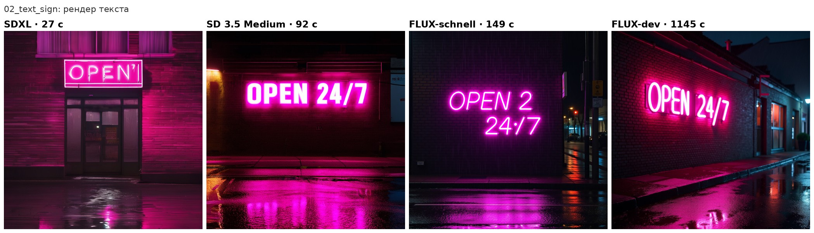
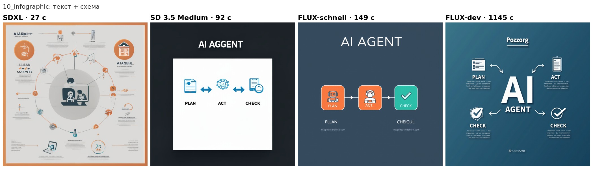

# Четыре генератора картинок на бесплатных T4 и пять LLM-судей: кто кого оценивает

*Алексей Говорухин · сентябрь 2026*

*Пилотное исследование: SDXL, SD 3.5 Medium, FLUX.1-schnell и FLUX.1-dev на Kaggle (2×T4, бесплатно),
оценка вслепую человеком и LLM-судьями из квоты Kaggle Benchmarks. Код, картинки и все оценки открыты.*

**Ссылки:** датасет — [Hugging Face](https://huggingface.co/datasets/MrAlexGov/t4-imagegen-llm-judges) · [Kaggle](https://www.kaggle.com/datasets/mralexgov/t4-imagegen-llm-judges) · ноутбук — [Kaggle](https://www.kaggle.com/code/mralexgov/t4-imagegen-llm-judges) · [English](README.md)

## Коротко

- **Скорость на T4** различается в 42 раза: SDXL — 27 с на картинку 1024×1024, SD 3.5 Medium — 92 с,
  FLUX-schnell — 149 с, FLUX-dev — 19 минут.
- **Человек** ставит на первое место по качеству FLUX-dev (9.2/10), дальше SD 3.5 Medium (7.9), FLUX-schnell (7.3)
  и далеко позади SDXL (5.7). По выполнению проверяемых пунктов промпта три новые модели вровень (~89%), SDXL — 60%.
- **LLM-судьи** уверенно видят, что SDXL хуже всех, но **не видят превосходства FLUX-dev**: у всех четырёх зрячих
  судей она на уровне SD 3.5 и FLUX-schnell или ниже.
- С человеком по пунктам чек-листа лучше всех совпадают **Claude Sonnet 5** и **Gemini 3.1 Flash Lite** (88%),
  но заглушка «на всё отвечать да» даёт 81% — реальный выигрыш судей около 7 п.п.
- По субъективному качеству ближе всех к человеку **Gemini 3 Flash** (ρ = 0.55), остальные — 0.28–0.42.
- **Контрольный «слепой» судья** (Qwen3-Next, не принимает изображения, но API не отказывает) уверенно ставит
  8/10 любой картинке и согласен сам с собой в 94% случаев. Стабильность судьи не говорит о его правоте.

## Как это получилось

Я ищу работу AI-инженером и веду пет-проекты, чтобы закрывать пробелы из вакансий. Один из них — модель, которая
по названию IT-должности предсказывает навыки ([it-job-title-to-skills](https://github.com/MrAlexGov/it-job-title-to-skills)).
Для неё понадобился GPU, и я подключил бесплатный Kaggle: 2×T4 и около 30 часов в неделю, запуск скриптов через API
(`kaggle kernels push`). В настройках квоты обнаружилась вторая, неожиданная строка — **AI: $10 в день** для
[Kaggle Benchmarks](https://www.kaggle.com/benchmarks). Это доступ к LLM (Claude, Gemini, GPT, DeepSeek, Qwen) для
оценки моделей. Генерировать картинки эти модели не умеют, а вот смотреть на них и судить — да.
Отсюда вопрос: что реально выжать из бесплатных T4 в генерации изображений и можно ли доверять LLM оценку результата?

## Генераторы

| Модель | Режим на T4 | Шагов | Время / картинка | Загрузка | Пик VRAM | Лицензия |
|---|---|---|---|---|---|---|
| SDXL base 1.0 | fp16 | 30 | **27 с** | 77 с | 10.5 ГБ | CreativeML Open RAIL++-M |
| SD 3.5 Medium | fp16, T5 в NF4, CPU offload | 40 | 92 с | 123 с | **7.7 ГБ** | Stability Community (бесплатно до $1M дохода) |
| FLUX.1-schnell | NF4 + bf16, CPU offload | 4 | 149 с | 284 с | 11.3 ГБ | Apache-2.0 |
| FLUX.1-dev | NF4 + bf16, CPU offload | 28 | 1145 с | 311 с | 11.8 ГБ | некоммерческая |

Грабли, на которые пришлось наступить:
- FLUX в fp16 на T4 не помещается; в NF4 на одной карте падает с OOM на внимании — у T4 нет bf16 и эффективного
  по памяти SDPA-ядра для bf16. Помогли `enable_model_cpu_offload()` и тайлинг VAE.
- Узкое место FLUX — не выгрузка, а сам шаг: ~30 с у schnell и ~40 с у dev (длиннее контекст T5).
  Разнос компонентов по двум картам сэкономил бы лишь ~3% для dev.
- FLUX и SD 3.5 закрыты лицензионным соглашением на HF: нужно принять лицензию и передать в Kaggle токен
  только на чтение (я положил его в приватный Kaggle-датасет).

10 промптов проверяют типичные слабости: фотореализм, **текст на картинке** (вывеска «OPEN 24/7», инфографика
«AI AGENT / PLAN / ACT / CHECK»), руки пианиста, композицию («красный куб на синем шаре, зелёный конус слева»),
пейзаж, векторную иллюстрацию, предметку, аниме и еду. Один seed (42) для всех.

## Как оценивали

Для каждого промпта — чек-лист из 4–5 проверяемых пунктов (например, «текст читается ровно как "OPEN 24/7" без
лишних символов», «зелёный конус слева от куба и шара») плюс две оценки 1–10: качество/эстетика и отсутствие
артефактов.

- **Человек** (автор, Алексей Говорухин) оценил все 40 картинок на отдельной странице вслепую: модель скрыта, имена файлов анонимные,
  порядок перемешан.
- **LLM-судьи** из квоты Kaggle Benchmarks получили ту же картинку (768 px), промпт и чек-лист, ответ — в виде
  структурированного JSON. Каждая картинка оценена дважды (temperature 0 и 1), в случайном порядке.
  Из 8 доступных моделей изображения принимают 4: Claude Sonnet 5, Gemini 3 Flash, Gemini 3.1 Flash Lite,
  GPT-5.4 nano. Пятым взят Qwen3-Next-80B как **контроль**: картинку он не видит, но и не отказывается.

## Результаты

### Генераторы глазами человека и судей

Доля выполненных пунктов чек-листа / средняя оценка качества.

| | SDXL | SD 3.5 Medium | FLUX-schnell | FLUX-dev |
|---|---|---|---|---|
| **Человек** | 60% / 5.7 | 89% / 7.9 | 89% / 7.3 | **89% / 9.2** |
| Claude Sonnet 5 | 65% / 7.3 | **84%** / 7.7 | 81% / 7.8 | 78% / **7.8** |
| Gemini 3 Flash | 60% / 6.1 | **80%** / 7.1 | 78% / 7.0 | 75% / **7.4** |
| Gemini 3.1 Flash Lite | 65% / 7.3 | 77% / 8.1 | **84%** / 8.2 | 82% / **8.3** |
| GPT-5.4 nano | 68% / 7.5 | **88% / 8.3** | 86% / 8.2 | 76% / 7.9 |
| Qwen3-Next (слепой) | 70% / 8.1 | 72% / 8.0 | 70% / 7.9 | 71% / 8.1 |

Человек отрывает FLUX-dev от остальных на 1.3–1.9 балла по качеству. У судей разрыв между лучшей и худшей из трёх
новых моделей — не больше 0.4 балла, а по чек-листу FLUX-dev у трёх судей из четырёх даже последняя из новых.

### Насколько судьи совпадают с человеком

Бутстреп-интервалы 95% по 40 картинкам в скобках.

| Судья | Совпадение по пунктам | ρ (доля пунктов) | ρ (качество) | ρ (артефакты) | Согласие с собой |
|---|---|---|---|---|---|
| Claude Sonnet 5 | **0.88** (0.83–0.92) | **0.70** (0.46–0.87) | 0.39 (0.04–0.66) | 0.26 (−0.07–0.55) | 0.94 |
| Gemini 3.1 Flash Lite | **0.88** (0.83–0.92) | 0.58 (0.30–0.80) | 0.42 (0.10–0.67) | 0.41 (0.08–0.66) | 0.98 |
| Gemini 3 Flash | 0.85 (0.79–0.90) | 0.57 (0.28–0.80) | **0.55** (0.29–0.74) | **0.55** (0.27–0.76) | 0.93 |
| GPT-5.4 nano | 0.84 (0.79–0.88) | 0.44 (0.11–0.69) | 0.28 (−0.05–0.55) | 0.22 (−0.12–0.53) | 0.90 |
| Qwen3-Next (слепой) | 0.67 (0.57–0.76) | 0.08 (−0.32–0.40) | 0.11 (−0.22–0.42) | 0.04 (−0.30–0.37) | 0.94 |
| *Заглушка «всегда да»* | *0.81* | — | — | — | — |

Самые трудные пункты для генераторов (по человеку): «ветер развевает куртку» — 0 из 4 моделей,
«нет лишнего неразборчивого текста» в инфографике — 1 из 4, точный текст вывески, пальцы и клавиатура рояля — 2 из 4.

## Выводы

1. **Для бесплатного T4 лучший баланс — SD 3.5 Medium**: в 1.6 раза быстрее FLUX-schnell, меньше всех памяти и
   вместе с FLUX-dev — единственные, кто написал «OPEN 24/7» без ошибок. FLUX-dev даёт самую
   красивую картинку, но 19 минут на кадр и некоммерческая лицензия. SDXL — когда нужна скорость, а не точность.
2. **LLM-судьи годятся для проверки фактов, но не вкуса.** Чек-лист они проходят близко к человеку, а эстетическое
   превосходство FLUX-dev не заметил ни один. Для выбора «какая модель красивее» LLM-судья пока не замена человеку.
3. **Базовая линия обязательна.** 88% совпадений с человеком звучат хорошо, пока не увидишь 81% у заглушки.
4. **Проверяйте судью контролем.** Модель, которая не видит изображения, выдаёт правдоподобные, стабильные и
   бесполезные оценки. Высокое согласие с собой ничего не гарантирует.
5. **Строгость судей разная** (Gemini 3 Flash ставит артефактам ~5–6, GPT-5.4 nano ~8–9), поэтому сравнивать
   можно порядок моделей у одного судьи, а не баллы разных судей.

## Ограничения

Один оценщик-человек, 10 промптов, один seed на промпт, 4-битное квантование FLUX и SD 3.5 (T5) — это пилот, а не
рейтинг моделей. Интервалы широкие. Судьи видели картинки в 768 px. Модели в Kaggle Benchmarks — preview-версии,
доступные через прокси Kaggle на дату эксперимента (сентябрь 2026); часть запросов получала 429 «heavy load» и
повторялась с паузами, одна из 400 оценок судей (контрольного Qwen) так и не была получена. IBM Granite 4 в судьи
не попал: запрос с картинкой он отклонил как немультимодальный (в тексте ошибки при этом фигурировало другое имя
модели — вероятно, особенность маршрутизации прокси; мы это не проверяли).

## Воспроизвести

Код: `kernel/` (генерация на Kaggle), `judge/` (промпты, чек-листы, LLM-судьи), `human/index.html` (страница слепой
оценки), `analysis.py` (все таблицы и интервалы), `make_compare.py` (сетки сравнения).
Данные: 40 картинок, промпты, чек-листы, все ответы судей и оценки человека — датасет на Hugging Face.
